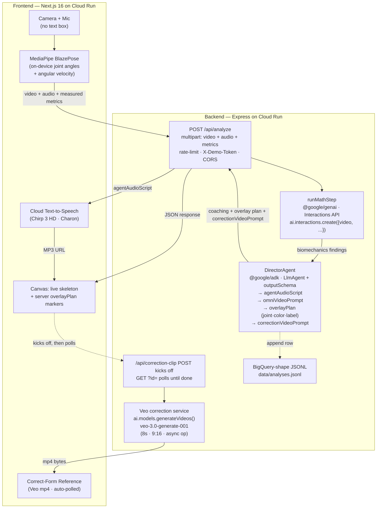

# OmniForm — The Ambient Biomechanics Lab

> A camera-on, mic-on AI coach with **no text box**. Hold the button, perform an
> athletic movement, release — and an agent that *sees, hears, and speaks* gives
> you instant, grounded biomechanics feedback with a glowing skeleton overlay on
> your own motion.

**Hackathon:** Google I/O — Build with AI Hackathon x Google Cloud Labs
**Category:** Live Agents (real-time audio + vision)
**Mandatory tech:** Google GenAI SDK (`@google/genai`, Gemini 3.5 Flash) · hosted on Google Cloud Run

---

## Team & Contributors

| Name | Role |
| --- | --- |
| Moorthy (vnarasingamoorthy@gmail.com) | Full-stack / AI |
| _Add teammate_ | _role_ |
| _Add teammate_ | _role_ |

> Update this table with every team member before submitting — the hackathon
> requires all contributors to be listed here.

---

## The Problem

Most "AI coaching" is a chat box: you type, it types back. That breaks down for
physical skills. An athlete fixing a soccer strike or a squat can't describe the
flaw — and reading paragraphs mid-rep is useless. Feedback needs to be **seen and
heard**, grounded in what your body actually did, not a wall of text.

## The Solution

OmniForm removes the keyboard entirely. The whole interface is a camera and a
single glowing button:

1. **Hold** the button — it records a 4-second video + microphone buffer while a
   live MediaPipe skeleton tracks your joints in real time.
2. **Release** — the clip, your voice, and **measured joint angles + peak angular
   velocity** (computed on-device) are sent to the backend.
3. **Gemini 3.5 Flash** analyzes the multimodal clip, grounded in the measured
   numbers, and returns concise coaching feedback as structured JSON.
4. The app **speaks** the feedback aloud via **Google Cloud Text-to-Speech**
   (newest Chirp 3: HD voice) while replaying your motion with **glowing vector
   lines drawn live on your joints**.

The agent sees (vision), hears (audio in), and speaks (audio out) — no text box anywhere.

---

## Architecture



The video bytes only leave the device to reach Gemini's Interactions API and are never persisted server-side — the result screen plays back the client's in-memory blob. Synthesized TTS audio + Veo correction clips are held server-side for ≤1 hour, then swept. The user's clip and the Veo reference play side-by-side so the athlete sees "what I did" next to "what corrected looks like."

### Why this scores on the rubric

- **Beyond Text / Multimodal UX (40%)** — zero text inputs; the agent sees, hears, and speaks. A real-time skeleton proves it perceives you live; a 4-stage streaming progress UI mirrors the real backend pipeline so users feel the agents working.
- **Google Cloud Native (30%)** — `@google/genai` Interactions API + `@google/adk` LlmAgent + `gemini-3.5-flash` + Cloud Text-to-Speech (Chirp 3 HD) + Cloud Run + Cloud Logging structured output + Secret Manager + MediaPipe.
- **Grounding / no hallucination (30%)** — joint angles and angular velocity are *measured* on-device (MediaPipe) and passed to Gemini as ground truth. The Director Agent's output is enforced by an `outputSchema` (Zod), so the JSON shape can't drift. Server-computed `overlayPlan` directives are rendered on top of MediaPipe-detected joints — the overlay can't show a finding the agent didn't actually emit.
- **Working, not a mockup** — verified end-to-end against the live Gemini API: real video → multimodal analysis → structured output → MediaPipe-anchored overlay markers → Chirp 3 HD voice playback → BigQuery-shape data pipeline row written.
- **Data flywheel** — every analysis writes a BigQuery-shape JSONL row (`analysis_id`, `model`, `source`, `client_metrics`, `math_findings`, `director_output`, `latency_ms`). Production deploy plugs straight into BigQuery streaming inserts.

---

## Tech Stack

| Layer | Technology |
| --- | --- |
| Frontend | Next.js 16 (App Router, TypeScript 6), React 19, Tailwind CSS v4, `react-webcam`, MediaRecorder API |
| On-device vision | **MediaPipe BlazePose** (`@mediapipe/tasks-vision`) — GPU WASM, runs entirely client-side |
| Backend | Node.js 20, Express 5, `multer` (in-memory multipart, 50MB cap), `cors`, `express-rate-limit` (10/min/IP) |
| Multimodal AI | **Google GenAI SDK** (`@google/genai` v2.6) · **Interactions API** (`ai.interactions.create()`) · **Gemini 3.5 Flash** — multimodal video analysis with `response_format: application/json` |
| Agent orchestration | **Agent Development Kit** (`@google/adk` v1.1) · `LlmAgent` with Zod `outputSchema` enforcement · `Runner.runEphemeral` · `InMemorySessionService` |
| Video generation | **Google Veo 3.1 fast** (`veo-3.1-fast-generate-preview`, with Veo 3 and Veo 2 fallbacks) via `ai.models.generateVideos()` — **image-to-video**: frontend extracts the first frame of the user's clip and passes it as the reference image so Veo animates the **same athlete in the same setting** executing the corrected technique. ~30–60s async long-running operation; backend proxies the Gemini Files URI as a local mp4 so the browser can play it directly. |
| Voice | **Google Cloud Text-to-Speech** (`en-US-Chirp3-HD-Charon`), browser `SpeechSynthesis` fallback |
| Data flywheel | **BigQuery-shape JSONL** (every analysis), production-ready for `bq load` or Cloud Function → streaming insert |
| Observability | **Cloud Logging** (JSON stdout with `severity` field, severity-aware auto-ingestion on Cloud Run) |
| Secrets | **Secret Manager** (`--update-secrets` bindings), never `--set-env-vars` |
| Hosting | **Google Cloud Run** (both services) — non-root containers, graceful `SIGTERM` drain, `0.0.0.0` bind, `/healthz` + `/health` probes |

---

## Run Locally

**Backend** (terminal 1):

```bash
cd backend
cp .env.example .env        # add GEMINI_API_KEY (required) + GOOGLE_TTS_API_KEY (optional)
npm install
node --env-file=.env index.js   # http://localhost:8080
```

**Frontend** (terminal 2):

```bash
cd frontend
cp .env.local.example .env.local   # defaults to localhost:8080
npm install
npm run dev                  # http://localhost:3000
```

Open http://localhost:3000, allow camera + mic, and hold the button.

> Without a `GEMINI_API_KEY` the backend still returns realistic mock coaching so
> the UI is always demoable; with a key set it runs live Gemini analysis end-to-end.

---

## Deploy to Google Cloud Run

One-shot deploy script handles both services + Secret Manager:

```bash
# Pre-reqs: gcloud auth login + billing-enabled project + backend/.env populated
# with GEMINI_API_KEY (and optionally GOOGLE_TTS_API_KEY).

PROJECT_ID=your-project-id ./deploy.sh
# or with a non-default region:
PROJECT_ID=your-project-id REGION=us-central1 ./deploy.sh
```

The script ([`./deploy.sh`](deploy.sh)):
1. Enables required APIs (Run, Build, Artifact Registry, Secret Manager, TTS, GenAI).
2. Creates / updates Secret Manager entries: `omniform-gemini`, `omniform-tts`, `omniform-demo-token`.
3. Grants the Cloud Run runtime service account `roles/secretmanager.secretAccessor`.
4. Deploys the **backend** (`omniform-analyzer`) with `--update-secrets` bindings.
5. Builds the **frontend** via Cloud Build with `NEXT_PUBLIC_API_URL` baked in, pushes to Artifact Registry, deploys to Cloud Run.
6. Updates the backend's `ALLOWED_ORIGIN` to the frontend URL (CORS lock).
7. Prints final URLs + the demo token.

Idempotent — re-run anytime to roll new code.

### Run Gemini through Vertex AI instead (Google Cloud auth)

The backend also supports Vertex AI via Application Default Credentials. Set these
env vars instead of `GEMINI_API_KEY`:

```bash
GOOGLE_GENAI_USE_VERTEXAI=true
GOOGLE_CLOUD_PROJECT=your-gcp-project-id
GOOGLE_CLOUD_LOCATION=us-central1
```

## Data flywheel

Every `/api/analyze` call appends one row to `backend/data/analyses.jsonl` with the full BigQuery-shape schema:

```json
{
  "analysis_id": "uuid",
  "timestamp_iso": "2026-05-22T17:32:13Z",
  "model": "gemini-3.5-flash",
  "source": "adk-interactions",
  "latency_ms": 11148,
  "client_metrics": { "leftKneeAngle": 120, "rightKneeAngle": 140, "peakAngularVelocity": 350 },
  "math_findings": { "kineticChainSummary": "...", "primaryFinding": "...", "powerLeakLocation": "leftKnee", "jointHighlights": ["leftKnee","rightKnee"] },
  "director_output": { "agentAudioScript": "...", "omniVideoPrompt": "...", "overlayPlan": [...] },
  "had_video": true,
  "had_audio": true,
  "tts_audio_url_emitted": true
}
```

Production deploy plugs this into BigQuery via either (a) `bq load --source_format=NEWLINE_DELIMITED_JSON` on a rotation, or (b) a Cloud Function triggered on GCS object creation that streams rows via `@google-cloud/bigquery`. The schema is BigQuery-ready — every field maps cleanly to a column type.

The pitch: this is the seed corpus for licensing labeled human-movement data to robotics + embodied-AI companies training motor-control models. The consumer app is the acquisition funnel; the BigQuery dataset is the moat.

## Security

Full posture documented in [SECURITY.md](SECURITY.md) — OWASP + STRIDE + supply-chain pass before deploy. Headline guardrails:

- Rate-limited + optionally token-gated `/api/analyze`
- `ALLOWED_ORIGIN`-bound CORS
- Sanitized metrics input (prompts can't be injected via numeric fields)
- Recorded video never persisted server-side
- TTS clip TTL: 1h sweep
- Non-root containers
- Secret Manager for keys

---

## Repository Layout

```
Omniform/
├── README.md                       # this file
├── SECURITY.md                     # security review + remediation status
├── deploy.sh                       # one-shot Cloud Run deploy (backend + frontend + Secret Manager)
├── OmniForm_Gamma_Deck_Prompt.md   # pitch-deck prompt for Gamma.app
├── frontend/                       # Next.js 16 app (Cloud Run)
│   ├── app/
│   │   ├── page.tsx                # capture flow, streaming UX, result screen
│   │   ├── layout.tsx
│   │   └── components/
│   │       └── PoseOverlay.tsx     # MediaPipe skeleton + server overlayPlan renderer
│   └── Dockerfile                  # non-root USER node, standalone build
├── backend/                        # Express + Gemini + ADK (Cloud Run)
│   ├── index.js                    # /api/analyze, /healthz, structured logging
│   ├── agents/
│   │   └── director.js             # Math step (Interactions API) + DirectorAgent (ADK)
│   ├── data/analyses.jsonl         # BigQuery-shape pipeline log (gitignored)
│   ├── public/audio/               # short-lived TTS MP3s (1h sweep)
│   ├── public/corrections/         # Veo correction reference clips (1h sweep)
│   └── Dockerfile                  # non-root USER node, Secret Manager pattern
└── deploy.sh                       # one-shot Cloud Run deploy
```
